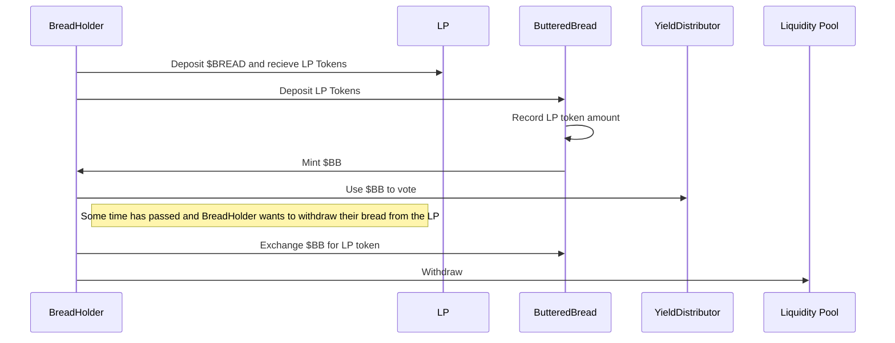
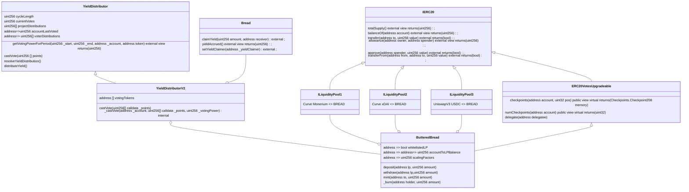
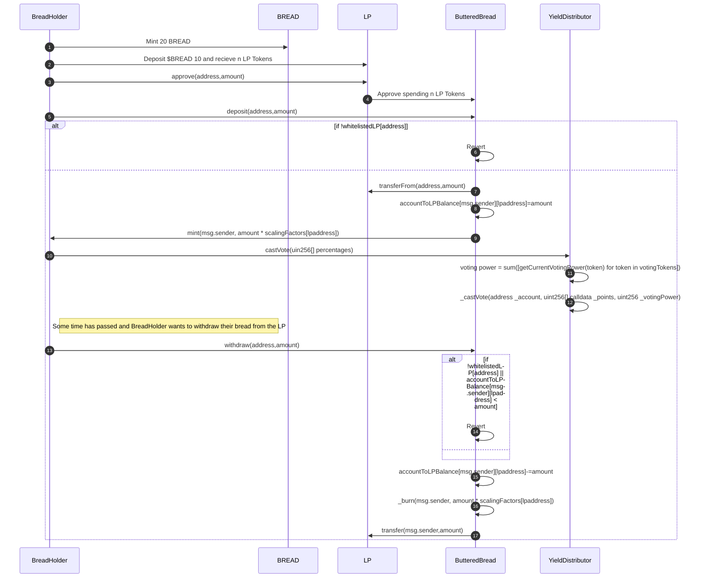

## Requirements 
-  Allow users who hold Breadchain sanctioned LPs to participate in governance 
-  Support multiple implementations of liquidity pools 
-  LP Token holders should be able to redeem their full amount deposited according to the LP conventions, and lose voting right if they redeem the non-$BREAD option 
-  Users should maintain usability of the LP frontend 
-  Removing or adding LP should be supported 
- Getting voting rights from multiple LP should be supported 
- Getting voting rights from LP and $BREAD at the same time should be supported 
## Concessions 
- Contributing non-$BREAD tokens to the LP will afford voting power 
- Users will have to alternate between LP Frontend and Breadchain Frontend 
- Voting power is effective only after `cycleLength` after LP tokens were exchanged for voting rights regardless of duration of tokens being in the LP 
- The voting token will not be transferable 
### Notes 
Butter -> Some LP Token 
ButteredBread -> A voting compatible token ,minted with different Butters  

## User flows 

## Implementation Suggestion 

This implementation relies on the idea that the "weight" for LP tokens is a constant, initialised when whitelisting a new LP. 
This relies on the assumption that the LP will always try to balance itself such that Butter will reach equilibrium, and if initialising the LP with an equal amount of $BREAD and some token in value (for example 1000 bread and 920 EUROs), we can take the virtual price of the Butter at that point to be our constant scaling factor. Given our assumption that the liquidity pools won't significantly depeg, this constant scaling factors simplifies our implementation. 

Without this assumption, another option is for the scaling factor to be determined at the time of deposit, and so $BB will be minted according to how much $BREAD the Butter is worth at the time of deposit. This introduces several dependencies 
- Each liquidity pool added must be added with an interface for fetching the current value of the LP tokens in BREAD 
- Only full unwraps of $BB for a given liquidity pool are allowed as the exchange rate between $BB and the Butter is dynamic and changing, and a partial withdrawal would require calculating how much $BB should be burned 

### UML 

### Function Flow 

